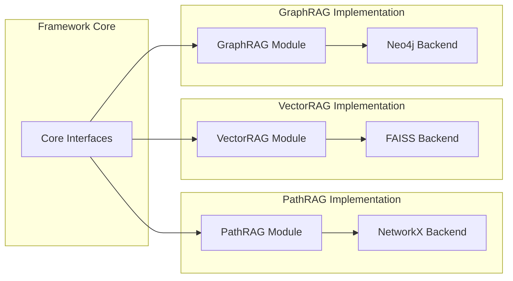
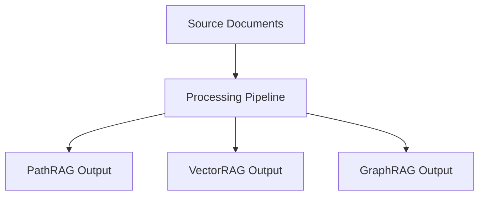
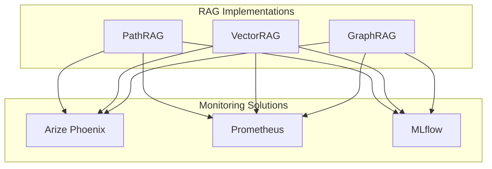

# RAG Dataset Builder: Extensible Architecture

This document outlines the architecture of the RAG Dataset Builder framework, emphasizing its database-agnostic, RAG-agnostic, and monitoring-agnostic design.

## Core Design Principles

The RAG Dataset Builder is built on the following principles:

1. **Modular Components**: Each part of the system is a separate module with well-defined interfaces
2. **Implementation Agnosticism**: No assumptions about specific database, embedding, or RAG implementations
3. **Extensibility**: Clear extension points for adding new implementations
4. **Minimal Dependencies**: Core framework has minimal dependencies, with implementation-specific dependencies isolated

## Architecture Overview

```mermaid
graph TD
    subgraph "Core Framework"
        IF[Interfaces] --> BC[Base Classes]
        BC --> PLUGINS[Plugin System]
    end
    
    subgraph "Document Processing"
        DP[DocumentProcessor] --> TXT[TextProcessor]
        DP --> PDF[PDFProcessor]
        DP --> CODE[CodeProcessor]
        DP --> CUSTOM[CustomProcessor]
    end
    
    subgraph "Chunking Strategies"
        TC[TextChunker] --> SW[SlidingWindow]
        TC --> SEM[Semantic]
        TC --> FIXED[FixedSize]
        TC --> CUSTOMC[CustomChunker]
    end
    
    subgraph "Embedding Generation"
        EM[Embedder] --> SBERT[SentenceTransformer]
        EM --> OPENAI[OpenAI]
        EM --> CUSTOM_EMB[CustomEmbedder]
    end
    
    subgraph "Storage Backends"
        SB[StorageBackend] --> NX[NetworkX]
        SB --> NEO4J[Neo4j]
        SB --> FAISS[FAISS]
        SB --> CHROMA[Chroma]
        SB --> PGVECTOR[PGVector]
        SB --> CUSTOM_DB[CustomBackend]
    end
    
    subgraph "RAG Implementations"
        RAG[RAGImplementation] --> PATH[PathRAG]
        RAG --> VECTOR[VectorRAG]
        RAG --> GRAPH[GraphRAG]
        RAG --> CUSTOM_RAG[CustomRAG]
    end
    
    subgraph "Performance Tracking"
        PT[PerformanceTracker] --> ARIZE[ArizePhoenix]
        PT --> PROM[Prometheus]
        PT --> MLFLOW[MLflow]
        PT --> CUSTOM_TRACK[CustomTracker]
    end
    
    PLUGINS --> DP
    PLUGINS --> TC
    PLUGINS --> EM
    PLUGINS --> SB
    PLUGINS --> RAG
    PLUGINS --> PT
```

## Extension Points

The framework provides several key extension points:

1. **Document Processors**: Add support for new document types or metadata extraction
2. **Text Chunkers**: Implement new strategies for chunking text
3. **Embedders**: Add new embedding models or services
4. **Storage Backends**: Support new database technologies
5. **RAG Implementations**: Add new types of RAG systems
6. **Performance Trackers**: Integrate with different monitoring systems

## Implementation Independence

Each implementation can be developed independently:

## Using Multiple RAG Implementations Simultaneously

The framework allows using multiple RAG implementations simultaneously, processing the same source documents:

## Monitoring Agnosticism

Different monitoring solutions can be used with any RAG implementation:

## Implementation Example: Adding a New RAG System

To add a new RAG system (e.g., "HybridRAG"), you would:

1. Implement the `RAGImplementation` interface
2. Choose or create appropriate storage backends
3. Register it with the plugin system

No changes to the core framework are needed.

## Implementation Example: Adding a New Database Backend

To add a new database backend (e.g., "Qdrant"):

1. Implement the `StorageBackend` interface
2. Use it in your RAG implementation
3. Register it with the plugin system

Again, no changes to the core framework are required.
